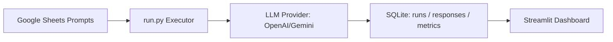

# 🌍 Geo Tracker

Geo Tracker is a lightweight benchmarking system for brand presence and sentiment analysis across online sources.  
It connects Google Sheets (for prompts), sends queries to LLM providers (OpenAI, Gemini), stores results in SQLite, and calculates metrics to benchmark **Sunday Natural** against competitors.

---

## 🚀 Features

- **Google Sheets integration** → Central source of prompts
- **LLM providers** → OpenAI (`chat/completions` & `responses API`) and Gemini (`generate_content` with Google Search)
- **Two modes**
  - `internal` → Model’s own knowledge
  - `provider_web` → Model’s native web search tools
- **Metrics**
  - Presence: Whether **Sunday Natural** appears in results
  - Sentiment: Polarity of context if Sunday Natural appears
  - Trust: Heuristic signals from sources and citations
- **Benchmarking Rules**
  1. No competitor list is provided → LLM responses must be parsed.
  2. If competitors appear but **not** Sunday Natural → presence = `0.0` (not `NaN`).
  3. If neither Sunday Natural nor competitors appear → presence = `None`.
- **SQLite-backed** → Tracks runs, responses, and metrics
- **Streamlit dashboard** for exploration

---

## 📦 Installation

Clone the repo and install dependencies in a virtual environment:

```bash
git clone <your-repo-url>
cd geo_tracker_full
python -m venv .venv
source .venv/bin/activate
pip install -r requirements.txt
```

Make sure `direnv` is installed and allowed:

```bash
direnv allow
```

---

## 🔑 Environment Setup

Create a `.env` file with:

```bash
# Google Sheets
GOOGLE_APPLICATION_CREDENTIALS=/path/to/service_account.json
GSHEET_SPREADSHEET_ID=<your-sheet-id>
GSHEET_WORKSHEET_NAME=Prompts

# OpenAI
OPENAI_API_KEY=sk-xxxx
OPENAI_DEFAULT_MODEL=gpt-4.1

# Gemini
GOOGLE_API_KEY=AIzaSyxxxx
GEMINI_DEFAULT_MODEL=gemini-1.5-flash
```

---

## 📊 Google Sheets Format

The system expects these columns:

| Old Column                   | New Column                                      |
|------------------------------|------------------------------------------------|
| `Prompt_DE`                  | `Shopping intent prompts, some general VMS prompts` |
| `Google_Flywheel_Keyword_Quelle` | `Keyword DE`                                  |
| `Topic`                      | `GEO Topic`                                    |
| `Metrik`                     | ❌ (no longer used)                             |

---

## ▶️ Running

### Gemini
```bash
python run.py --provider gemini --model gemini-1.5-flash --mode provider_web --market DE --lang de --raw --start 0 --limit 200
```

### OpenAI
```bash
python run.py --provider openai --model gpt-4.1 --mode provider_web --market DE --lang de --raw --start 0 --limit 200
```

### Streamlit Dashboard
```bash
streamlit run streamlit_app.py
```

---

## 🗄️ SQLite Database

Schema (auto-created via `db.py`):

- **runs** → metadata for each execution
- **responses** → raw LLM responses
- **metrics** → computed metrics (presence, sentiment, trust)

Inspect DB:

```bash
sqlite3 geo_tracker.db
.tables
.schema runs
SELECT provider, mode, COUNT(*) FROM runs GROUP BY provider, mode;
```

---

## 📑 Expected Output Logs

Example run log:

```
[gsheets] Source: Sheets API • Rows: 995
[runner] Using slice start=0, limit=200, rows=200

[69/200] run start • prompt_id=p069 • q='wo kann man in Deutschland Nahrungsergänzungsmittel online kaufen' • mode=provider_web • raw=True
[69/200] run_id=112 inserted
[69/200] response saved • sources=3 • chars=2366
[69/200] metrics saved • presence=0.0 • sentiment=-0.1 • trustA=0.75 • trustS=0.60
```

Key signals:
- `sources=3` → web citations extracted
- `presence=0.0` → Sunday Natural not present but competitors were
- `sentiment=-0.1` → slightly negative tone around Sunday Natural
- `trustA` / `trustS` → heuristic trust metrics

---

## 📈 Workflow Diagram



---

## ✅ Summary

Geo Tracker gives you a repeatable way to:
- Track how **Sunday Natural** appears across search queries
- Benchmark against competitors (presence and sentiment)
- Use real-time web-grounded LLMs for market insights
- Persist data and explore it via a dashboard
